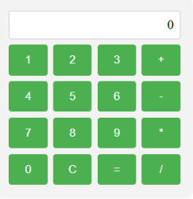

## Ejercicios

1. Escriu un programa en JavaScript que demani a l'usuari que introdueixi el seu nom i
després mostri un missatge de benvinguda amb el nom introduït.

2. Escriu un programa en JavaScript que demani a l'usuari que introdueixi dos nombres i
després mostri la suma dels dos nombres introduïts.

3. Escriu un programa en JavaScript que demani a l'usuari que introdueixi una
temperatura en graus Celsius i després mostri la temperatura convertida a graus
Fahrenheit utilitzant la fórmula: Fahrenheit = (Celsius × 9/5) + 32.

4. Escriu un programa en JavaScript que demani a l'usuari que introdueixi la seva edat i
després mostri un missatge indicant si l'usuari és major d'edat o no.

5. Escriu un programa en JavaScript que demani a l'usuari que introdueixi dos nombres i
després mostri el resultat de diverses operacions matemàtiques, com la suma, la resta,
la multiplicació i la divisió, utilitzant aquests dos nombres.

6. Escriu un programa en JavaScript que demani a l'usuari que introdueixi una
contrasenya i després comprovi si la contrasenya té almenys 8 caràcters i conté
almenys una lletra majúscula, una lletra minúscula i un nombre. Si la contrasenya
compleix aquests requisits, mostra un missatge de confirmació, sinó mostra un
missatge d'error.

7. Crea una calculadora operativa amb este disseny:
 
 
